# iTALC 활용
[TOC]

* * *

## 1. 소개
### 1.1 iTALC?
iTALC는 Intelligent Teaching And Learning with Computers의 약자로 전산 강의실에서 효율적으로 수업을 할 수 있도록 도와주는 도구입니다.
iTALC는 교사에게 있어 강력한 교수 도구로 활용할 수 있습니다. 이 프로그램은 다양한 방법으로 같은 네트워크 안에 있는 다른 컴퓨터들의 화면을 보거나 조작을 할 수 있습니다. 또한 리눅스, 윈도우 XP와 7 등을 지원하며 이 운영체제들이 혼용되어도 같이 사용할 수 있습니다.
상용으로 판매중인 이러한 류의 프로그램들과는 달리 iTALC는 무료입니다! 즉 비싼 라이센스비를 지불하지 않고 자유롭게 사용할 수 있습니다. 게다가 소스코드가 공개되어 있어 여러분의 의도에 맞게 iTALC의 라이센스(GPL) 하에서 소프트웨어를 자유롭게 수정해서 사용할 수 있습니다. 즉 두 가지 측면에서 자유(Freedom)롭습니다.

- - -

### 1.2 특징
iTALC는 학교에서 사용하는 것을 가정하고 설계되었습니다. 그러므로 다음과 같이 교사들이 필요로 하는 많은 기능들을 제공합니다.
* `전체보기 모드(overview)`를 사용하여 전산수업에서 학생들의 작업 상황을 보고 `스냅샷`을 찍을 수 있습니다.
* `원격 제어(remote control computers)`로 학생들을 지원하거나 도와줄 수 있습니다.
* (풀스크린 또는 창모드로) `데모 시연(show a demo)` 할 수 있습니다. 즉 실시간으로 모든 학생들의 컴퓨터에 교사의 화면을 띄울 수 있습니다.
* `조작잠금(lock workstations)`을 사용하여 집중하지 않는 학생들의 컴퓨터의 조작을 잠글 수 있습니다.
* 학생들 또는 특정 학생에게 `텍스트 메세지(text message) 전송`을 할 수 있습니다.
* 원격에서 전원을 키고 끄거나 재시작을 할 수 있습니다.
* 원격으로 윈도우 로그인 또는 로그오프를 하고 특정 실행명령이나 스크립트를 실행할 수 있습니다.
* 홈스쿨링(home schooling) - iTALC의 네트워크 기술은 서브넷에 제한받지 않으므로 학생들이 iTALC 클라이언트에 있는 VPN-connection 기능을 사용하여 집에서도 수업에 참가할 수 있습니다.

앞으로 iTALC는 (과도한 쓰레드에서도 잘 작동하도록) 멀티코어 시스템에 최적화해나갈 것입니다. 여러분의 컴퓨터가 얼마나 많은 코어를 가지고 있든지간에, iTALC는 사용 가능할 것입니다.

- - -

### 1.3 관련 사이트
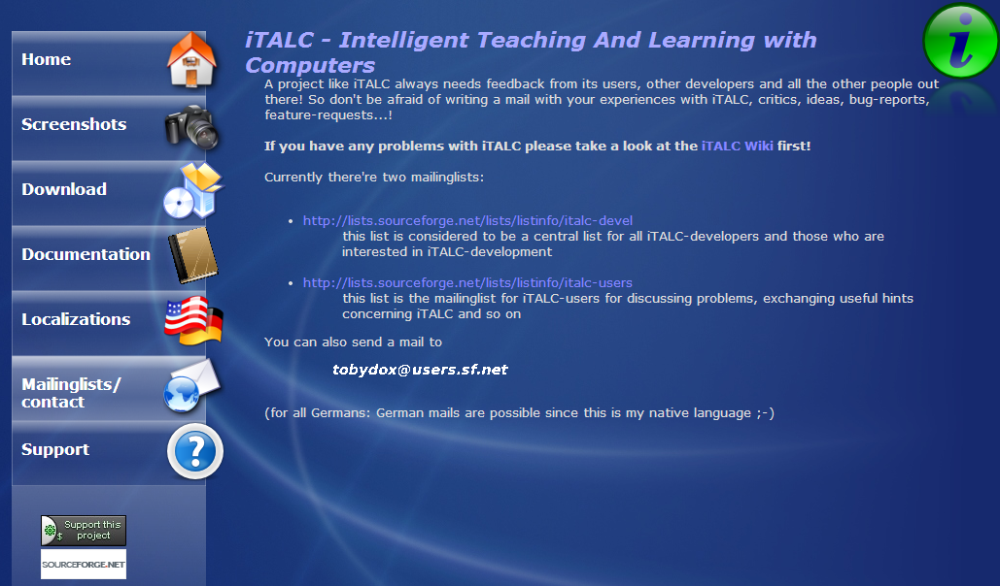

* 공식 홈페이지 : http://italc.sourceforge.net/
* 깃허브 : https://github.com/iTALC/italc
* 다운로드 : http://sourceforge.net/projects/italc/files/italc2/

- - -

### 1.4 최신 버전
2013년 8월 6일 현재 2.0.1이 최신 버전입니다.
소스파일과 윈도우즈 32비트용, 64비트용 설치 파일을 제공하고 있습니다.(용량 윈도우용 기준 약 8메가)

- - -

### 1.5 라이센스
GPL 라이센스로 제작되어 개인, 사업체, 공공기관 등에서 라이센스 걱정 없이 사용할 수 있습니다. 다만 소스의 개작이 이루어질 경우 GPL 라이센스를 계승해야 합니다.

* * *

## 2. 설치

### 2.1 설치 전 준비사항(교사용, 학생용 공통)
윈도우즈에서 설치할 경우 관리자(Administrator) 권한을 가진 영문이름으로 된 계정이 있어야 하며 이 계정은 암호가 설정되어 있어야 합니다. 아래 설치 설명에는 관리자 권한을 가진 영문이름으로 된 계정이 있으며 암호는 설정되어있지 않다고 가정하고 암호 설정 및 자동 로그인 작업을 하는 것부터 시작합니다.
iTALC를 설치하고 설정할 때 강사PC와 학생PC를 연결하기 위한 인증 방법은 여러 방법이 있습니다. 그 중 여기에서는 가장 단순하고 쉬운(하지만 보안에 취약할 수 있는) 윈도우 계정 아이디/암호를 이용한 인증 방법을 사용할 것입니다.
이 쉬운 `윈도우 계정 아이디/암호`를 이용하는 방법은 강사 컴퓨터와 학생 컴퓨터 모두 같은 이름과 암호를 가지는 계정이 있어야 합니다. 따라서 강사 컴퓨터와 학생 컴퓨터 모두 아래 과정을 진행해야 합니다.

- - -

#### 2.1.1 사용자 계정 이름 영문여부 확인
사용자 계정의 이름이 영문이고 유형이 `관리자(Administrator)`인지 확인합니다. 아니라면 `관리자(Administrator)` 유형의 영문이름 계정을 하나 만들어줍니다. 여기서는 `italc`이라 하겠습니다.


- - -

#### 2.1.2 계정 암호 생성
계정을 생성 할 때 암호를 지정해줍니다. 암호를 생략해서 만들었거나 사용하려는 계정의 암호가 없다면 암호를 지생성해줍니다. `윈도우`-`제어판`-`사용자 계정 및 가족 보호`-`사용자 계정`에서 암호를 생성하거나 변경할 수 있습니다. 단, 학생용 PC에도 같은 아이디, 암호를 사용하는 계정을 만들어야하니 암호를 개인이 사용하는 암호로 지정하지 마시기 바랍니다.


여기서는 `italc!@#$`로 하겠습니다.


다음과 같이 사용자 이름, 유형 밑에 `암호 사용`이 나타나면 암호가 설정이 된 계정입니다. 


- - -

#### 2.1.3 윈도우 자동 로그인 설정
자동 로그인 기능을 쓰려면 다음 과정을 수행합니다. 로그인 메뉴를 통해서 윈도우를 쓴다면 따라하지 않아도 됩니다.


`시작`-`실행` 을 클릭하거나 `윈도우키 + r`을 눌러 `실행` 창을 띄운 후 다음 명령어를 입력해서 실행합니다.

```
netplwiz
```


또는 다음 명령어도 같은 역할을 합니다만 길어서 위쪽 명령어를 더 선호할겁니다.

```
control userpasswords2
```


실행하면 `사용자 계정` 윈도우가 나타납니다. 여기서 자동 로그인을 할 `사용자 이름`을 클릭하신 후 위에 사용자 아이콘 밑에 있는 `사용자 이름과 암호를 입력해야 이 컴퓨터를 사용할 수 있음` 체크박스를 `해제` 하십시요. 그런 후 `확인`을 누르면 암호를 물어볼텐데, 아까 설정한 암호를 2번 입력해줍니다. 그런 후 `확인`을 누르세요. 축하합니다. 이제 앞으로는 윈도우를 키면 자동으로 방금 설정한 사용자 이름으로 로그인이 될 것입니다.

여기까지 iTALC 설치를 위한 작업이 끝났습니다. 이제 iTALC를 설치해 보기로 합시다. 

### 2.2 설치 프로그램 다운로드(교사용, 학생용 공통)
설치 파일은 사이트에서 다운로드 합니다. 홈페이지에서 좌측 다운로드 메뉴를 클릭한 후, `continue`를 클릭하거나 아래 링크로 바로 들어갑니다. 여기서는 최신 버전인 2.0.1로 다운로드합니다. (강사용과 학생용이 특별히 나뉘어 있지 않으며 설치할 때 옵션만 달라집니다.)

> 다운로드 URL : http://sourceforge.net/projects/italc/files/italc2/

`2.0.1` 폴더로 들어가면 3종류 파일로 나뉘어 배포되고 있습니다.이 중 확장자가 `tar.gz`인 파일은 리눅스 등을 위한 파일이며 `.exe`로 끝나는 파일이 윈도우용 파일입니다. 이 중 `win32`가 들어간 파일은 32비트용 윈도우, `win64`는 64비트용 윈도우를 위한 설치 파일입니다. 사용자의 윈도우의 종류에 맞게 다운로드하여 설치하면 됩니다. 여기서는 `win64`로 다운받아 설치하겠습니다. 용량이 8메가 정도로 매우 가볍습니다.

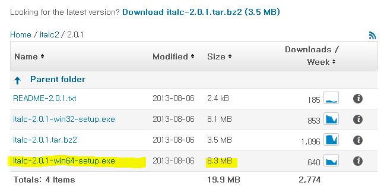

파일을 다운받은 교사용, 학생용 컴퓨터에 따라서 진행해 나갑니다.


- - -

### 2.3 교사용 컴퓨터 설치(iTALC Service + Master 설치)

#### 2.3.1 프로그램 설치
설치 파일을 더블클릭해서 설치합니다. `다음`을 눌러서 기본 설정대로 진행합니다. 그러다 `구성 요소 선택` 화면에서 아래과 같이 `iTALC Service`와 `iTALC Master`가 `모두 체크`되어 있는지 확인하고 `모두 설치`합니다. iTALC Master가 바로 관리자 프로그램이므로 이 프로그램이 설치가 되어있어야 합니다. 반면 학생 컴퓨터는 설치하면 안됩니다.

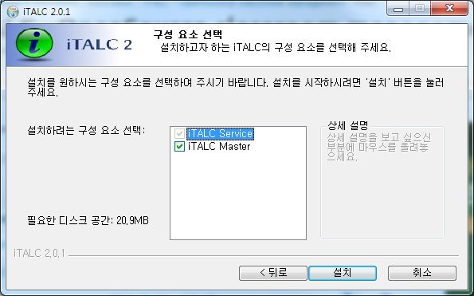

`설치`를 눌러서 진행하면 프로그램들이 설치가 됩니다.

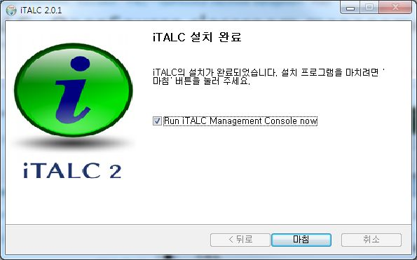

`마침`을 누릅니다.

- - -

#### 2.3.2 iTALC Management Console 설정
이제 계정 설정을 합니다. 처음 실행되면 아래와 같은 화면이 나타납니다. `Authentication` 탭을 클립합니다.

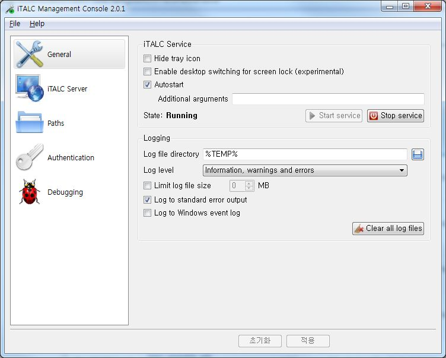

처음 실행했을 때는 iTALC가 작동할 윈도우 계정이 추가되어있지 않습니다. 따라서 동작할 권한을 주어야 합니다. 아래와 같이 화면이 나타나면 `Manage permissions` 버튼을 클릭합니다.

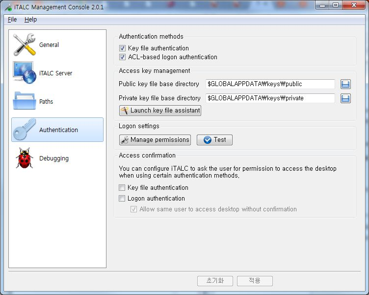

사용자가 등록되어 있지 않습니다. 이 상태에서는 iTALC 프로그램이 정상적으로 동작하지 않습니다. `추가` 버튼을 누릅니다.

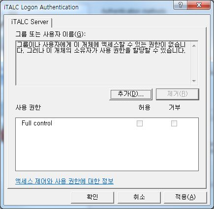

빈칸에 앞에서 생성한 계정 이름(여기서는`italc`)를 입력하고 우측에 있는 `이름 확인` 버튼을 클릭합니다. 그러면 Full Name이 나타나게 됩니다. `확인`을 누릅니다.

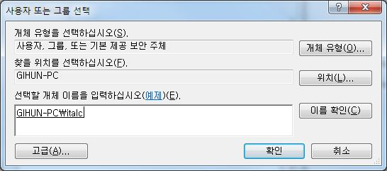

그러면 이제 사용자란에 추가한 사용자이름이 나타나고 권한도 `Full Control`로 체크되어 있는 것을 확인할 수 있습니다. `확인` 버튼을 누릅니다.

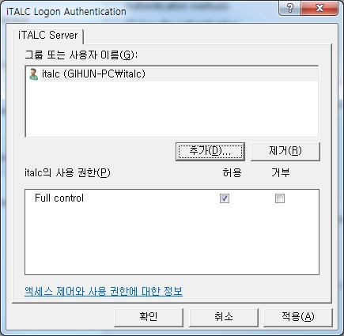

다시 이 화면으로 돌아왔습니다.


`적용` 버튼을 누르면 관련 서비스가 재시작된다는 확인창이 뜹니다. `예`를 눌러서 반영하면 이제 iTalc 기본 설정이 끝납니다.

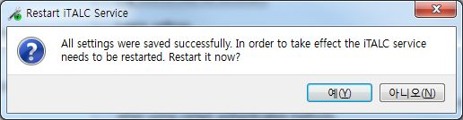

교사용 컴퓨터 설정이 끝났습니다. 나머지는 `관리 프로그램 활용`에서 다룹니다.

- - -

### 2.4 학생용 컴퓨터 설치(iTALC Service만 설치)

#### 2.4.1 프로그램 설치
설치 파일을 더블클릭해서 설치합니다. `다음`을 눌러서 기본 설정대로 진행합니다. 그러다 `구성 요소 선택` 화면에서 아래과 같이 `iTALC Service`만 체크되고 `iTALC Master`는 `체크 해제`되어 있는지 확인합니다. iTALC Master는 관리자 프로그램이므로 학생 컴퓨터에는 설치하면 안됩니다.

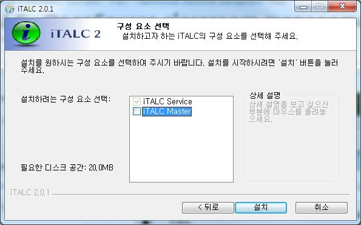

`설치`를 눌러서 진행하면 프로그램들이 설치가 됩니다.


`마침`을 누릅니다.

- - -

#### 2.4.2 iTALC Management Console 설정
이제 계정 설정을 합니다. 처음 실행되면 아래와 같은 화면이 나타납니다. `Authentication` 탭을 클립합니다.


처음 실행했을 때는 iTALC가 작동할 윈도우 계정이 추가되어있지 않습니다. 따라서 동작할 권한을 주어야 합니다. 아래와 같이 화면이 나타나면 `Manage permissions` 버튼을 클릭합니다.


사용자가 등록되어 있지 않습니다. 이 상태에서는 iTALC 프로그램이 정상적으로 동작하지 않습니다. `추가` 버튼을 누릅니다.


빈칸에 앞에서 생성한 계정 이름(여기서는`italc`)를 입력하고 우측에 있는 `이름 확인` 버튼을 클릭합니다. 그러면 Full Name이 나타나게 됩니다. `확인`을 누릅니다.


그러면 이제 사용자란에 추가한 사용자이름이 나타나고 권한도 `Full Control`로 체크되어 있는 것을 확인할 수 있습니다. `확인` 버튼을 누릅니다.


다시 이 화면으로 돌아왔습니다.


`적용` 버튼을 누르면 관련 서비스가 재시작된다는 확인창이 뜹니다. `예`를 눌러서 반영하면 이제 iTalc 기본 설정이 끝납니다.


학생용은 서비스로만 설치되기 때문에 여기까지 작업하면 설정이 모두 끝납니다. 더이상 학생용 컴퓨터에서는 작업할 것이 없습니다. =D

* * *

## 3. iTALC Master 활용(관리 프로그램)
### 3.1 Master 프로그램 실행
`Master` 프로그램을 메뉴에서 실행합니다. 메뉴 이름은 `iTALC`로 되어있습니다.

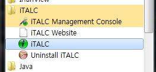

실행하면 사용자 로그인을 하라고 나타납니다. 아마 현재 로그인 되어있는 계졍 이름이 들어가 있을텐데 삭제합니다.

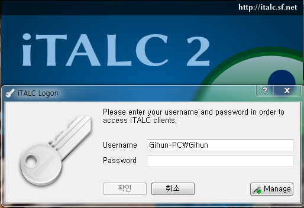

그리고 `username`에 생성한 계정 이름(여기서는 `italc`)과 암호(여기서는 `italc!@#$`)를 입력하고 `확인`을 누릅니다.

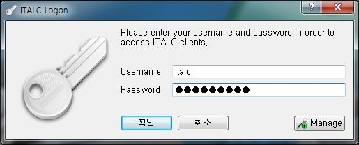

아래와 같은 화면이 나오면 로그인이 성공한 것입니다.


### 3.2 강의실, 컴퓨터 등록하기
왼편 탭에 있는 아이콘 중 두번째 아이콘을 선택하여 `강의실 관리`를 나타나게 합니다.


#### 3.2.1 강의실 등록하기
컴퓨터를 관리하려면 적어도 하나의 강의실에 컴퓨터가 추가되어 있어야 합니다. 강의실은 교과로 할지, 교실 중심으로 할지, 선생님 단위로 할 지 마음대로 정의할 수 있습니다. 일단 강의실을 추가하기 위하여 하얀 부분에서 마우스 오른쪽 클릭, 강의실 추가하기를 선택합니다.

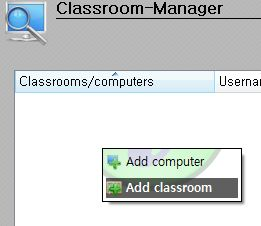

그러면 강의실 이름을 입력하는 칸이 나오는데 적절하게 입력해 줍니다.

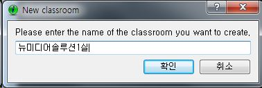

- - -

#### 3.2.2 컴퓨터 등록하기
강의실에 컴퓨터를 등록하려면 강의실에서 마우스 오른쪽 클릭, `Add computer`를 선택합니다.
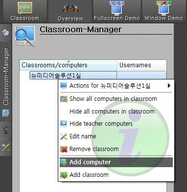

그러면 아래와 같이 아이피, 표시될 이름, 맥주소, 강의실 및 종류를 선택할 수 있습니다.
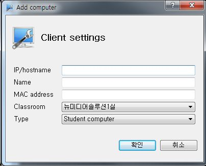

아래와 같이 학생 컴퓨터의 아이피와 목록에 표시될 이름을 입력합니다. 그리고 종류는 크게 3개가 있는데, 여기서는 학생용이니 `Student computer`로 등록합니다. 교사 컴퓨터도 등록할 수는 있으나 관리 상 어려움이 생길 수 있고 그다지 메리트가 없어서 강의실에 교사 컴퓨터는 추가하지 않는 편이 좋습니다.(예를 들어 실수로 강의실 전체에 잠금을 걸어버릴 경우 교사용 컴퓨터도 같이 걸려버립니다.)

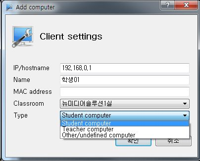

- - -

### 3.3 학생컴퓨터 제어 명령
학생 컴퓨터의 상황을 보고 싶다면 해당 학생 컴퓨터를 더블클릭하면 화면 상황이 나탄납니다. 강의실을 더블클릭하면 강의실 전체의 컴퓨터들의 상황이 나타나게 됩니다.

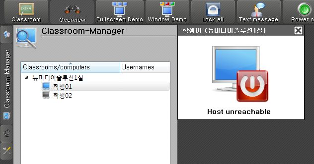

특정 학생 컴퓨터에 명령을 내리고자 한다면 오른쪼 마우스 클릭을 하여 명령을 내릴 수 있습니다. 아래는 명령에 대한 설명을 나타낸 표입니다.

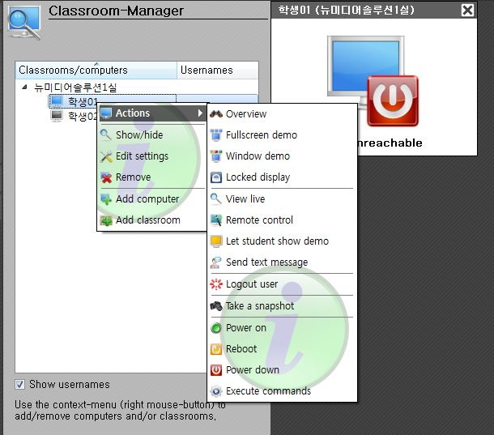


| 명령 | 설명 |
| - | - |
| Overview | 강의실의 컴퓨터들 상황을 봅니다. 컴퓨터들이 작게 나타나서 현황을 관찰할 수 있습니다. |
| Fullscreen demo | 전체화면으로 교사 컴퓨터의 화면을 학생 컴퓨터 화면에 나타나게 합니다. 교사의 시연 장면을 보게할 때 사용할 수 있습니다. |
| Window demo | 창모드로 교사 컴퓨터의 화면을 학생 컴퓨터 화면에 나타나게 합니다. 학생은 그 창의 위치를 옮길 수 있으며 다른 작업을 같이 할 수 있습니다. |
| Locked display | 화면을 닫고 조작을 막습니다. 다만 완벽히 막을 수 있는 것은 아니라서, 사용자가 `Ctrl + Alt + Del`을 눌러서 작업관리자를 실행, lock process를 kill하는ㄴ 방식으로 빠져나올 수 있습니다. |
| View live | 특정 학생 컴퓨터의 화면을 교사 컴퓨터에서 실시간으로 봅니다. |
| Remote control | 학생 컴퓨터를 원격 제어합니다. 교사는 학생 컴퓨터 화면의 마우스 제어와 키보드 입력을 할 수 있습니다. 단, 이 부분에서 한글 입력은 안되는 것에 주의해야 합니다. |
| Let student show demo | 학생의 작업 화면을 다른 학생에게 보입니다. |
| Send text message | 특정 컴퓨터에 텍스트 메시지를 보냅니다. 한글이 가능합니다. |
| Logout user | 특정 학생 컴퓨터의 윈도우 계정 로그아웃을 합니다. 그다지 사용할 일은 적어보입니다. |
| Take a snapshot | 특정 학생 컴퓨터 화면을 캡쳐해서 저장합니다. |
| Power on | 특정 컴퓨터의 전원을 킵니다. 하지만 보안기능 등의 문제로 잘 작동하지 않습니다. |
| Reboot | 특정 컴퓨터를 재시작합니다. |
| Power down | 특정 컴퓨터를 종료시킵니다. 아주 잘 작동하며 수업 후에 사용하면 효과적입니다. |
| Execute commands | 콘솔 명령이나 스크립트 명령어를 실행합니다. | 

강의실 대상으로도 명령이 가능합니다.

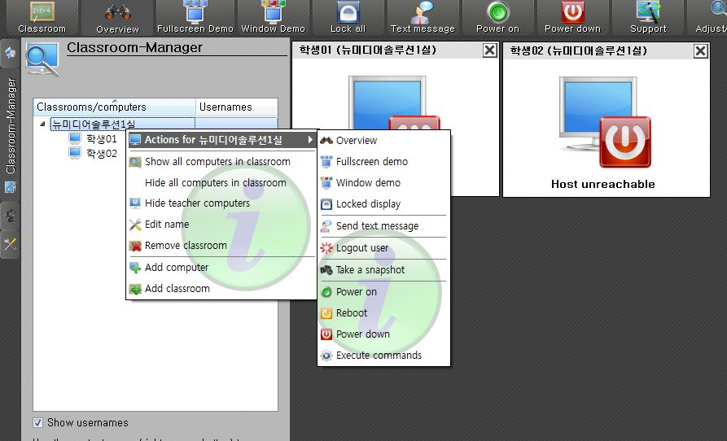

- - -

### 3.4 기타 메뉴
#### 3.4.1 iTALC 둘러보기

iTALC의 메뉴에 대한 소개입니다.

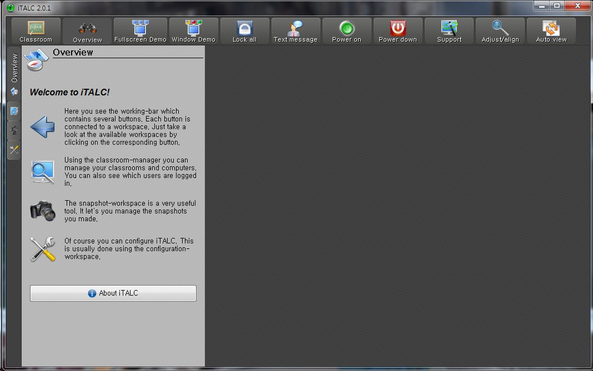


- - -

#### 3.4.2 iTALC 스냅샷
스냅샷을 찍으면 이 곳에 모여서 저장됩니다. 저장된 스냅샷 파일을 활용할 때 쓰일 수 있습니다. 

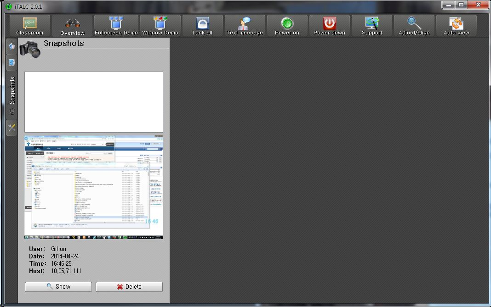

- - -

#### 3.4.3 iTALC 설정
iTALC에 대한 설정을 할 수 있는 멘뉴입니다. 학생 컴퓨터 화면의 갱신 주기나 기타 UI에 대한 설정 등을 할 수 있습니다.

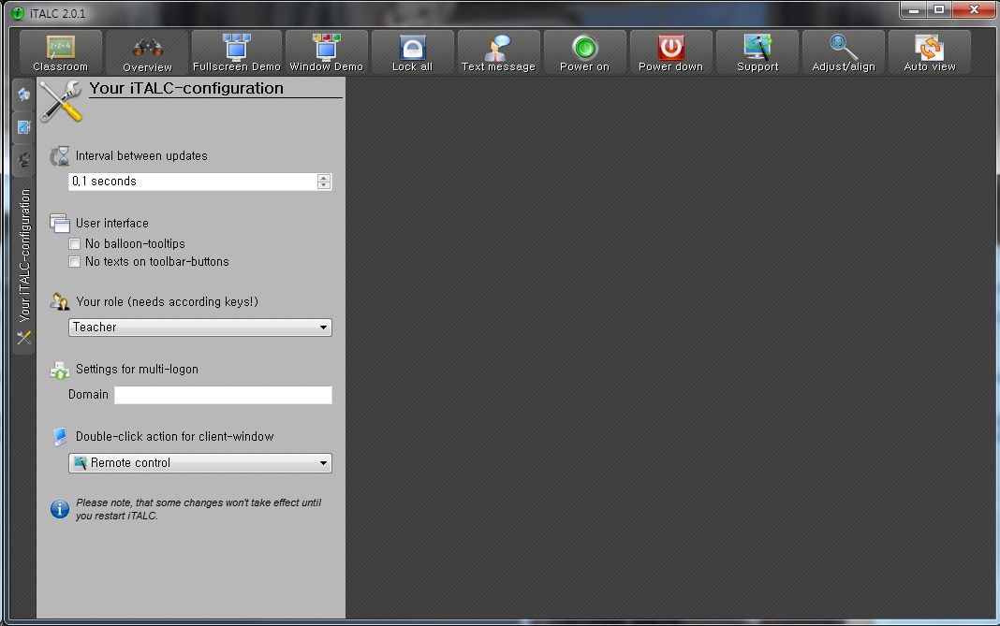


* * *

## 4. 버그
1. 윈도우 계정명이 한글이면 Master 로그인 불가
2. 윈도우 계정이 암호가 걸려있지 않으면 Master 로그인 불가
3. 원격제어 모드에서 한글 입력이 안됨(한글로 입력하면 키입력이 무시되서 원격 컴퓨터로 안넘어감)

- - -

## 5. TODO
* 메뉴 한글화


