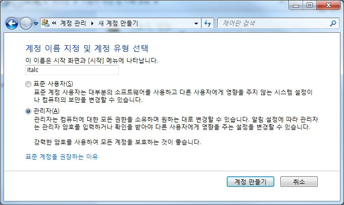
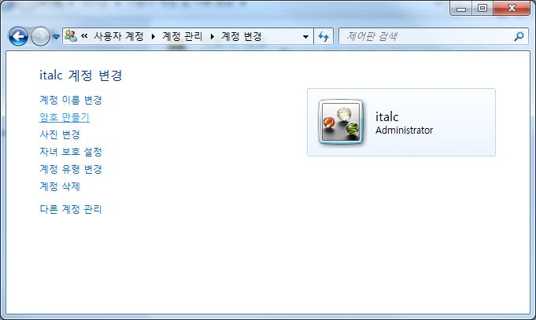
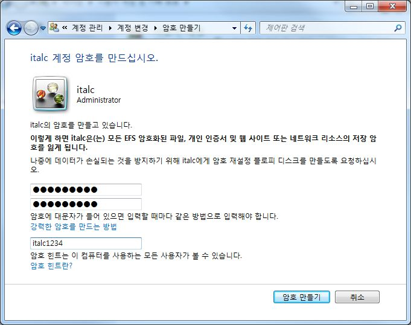
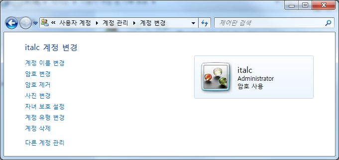
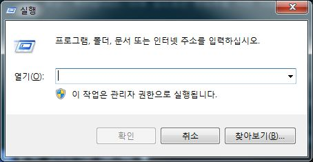
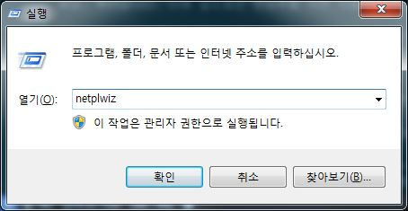
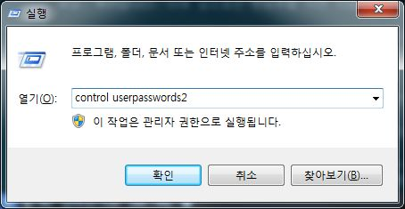

# iTALC 활용
## 1. 소개
### iTALC?
iTALC는 Intelligent Teaching And Learning with Computers의 약자로 전산 강의실에서 효율적으로 수업을 할 수 있도록 도와주는 도구입니다.
iTALC는 교사에게 있어 강력한 교수 도구로 활용할 수 있습니다. 이 프로그램은 다양한 방법으로 같은 네트워크 안에 있는 다른 컴퓨터들의 화면을 보거나 조작을 할 수 있습니다. 또한 리눅스, 윈도우 XP와 7 등을 지원하며 이 운영체제들이 혼용되어도 같이 사용할 수 있습니다.
상용으로 판매중인 이러한 류의 프로그램들과는 달리 iTACL는 무료입니다! 즉 비싼 라이센스비를 지불하지 않고 자유롭게 사용할 수 있습니다. 게다가 소스코드가 공개되어 있어 여러분의 의도에 맞게 iTALC의 라이센스(GPL) 하에서 소프트웨어를 자유롭게 수정해서 사용할 수 있습니다. 즉 두 가지 측면에서 자유(Freedom)롭습니다.

### 특징
iTACL는 학교에서 사용하는 것을 가정하고 설계되었습니다. 그러므로 다음과 같이 교사들이 필요로하는 많은 기능들을 제공합니다.
* `전체보기 모드(overview)`를 사용하여 전산수업에서 학생들의 작업 상황을 보고 `스냅샷`을 찍을 수 있습니다.
* `원격 제어(remote control computers)`로 학생들을 지원하거나 도와줄 수 있습니다.
* (풀스크린 또는 창모드로) `데모 시연(show a demo)` 할 수 있습니다. 즉 실시간으로 모든 학생들의 컴퓨터에 교사의 화면을 띄울 수 있습니다.
* `조작잠금(lock workstations)`을 사용하여 집중하지 않는 학생들의 컴퓨터의 조작을 잠글 수 있습니다.
* 학생들 또는 특정 학생에게 `텍스트 메세지(text message) 전송`을 할 수 잇습니다.
* 원격에서 전원을 키고 끄거나 재시작을 할 수 있습니다.
* 원격으로 윈도우 로그인 또는 로그오프를 하고 특정 실행명령이나 스크립트를 실행할 수 있습니다.
* 홈스쿨링(home schooling) - iTACL의 네트워크 기술은 서브넷에 제한받지 않으므로 학생들이 iTALC 클라이언트에 있는 VPN-connection 기능을 사용하여 집에서도 수업에 참가할 수 있습니다.

앞으로 iTALC는 (과도한 쓰레드에서도 잘 작동하도록) 멀티코어 시스템에 최적화해나갈 것입니다. 여러분의 컴퓨터가 얼마나 많은 코어를 가지고 있든지간에, iTALC는 사용 가능할 것입니다. 

### 관련 사이트
* 공식 홈페이지 : http://italc.sourceforge.net/
* 깃허브 : https://github.com/iTALC/italc
* 다운로드 : http://sourceforge.net/projects/italc/files/italc2/

### 최신 버전
2013년 8월 6일 현재 2.0.1이 최신 버전입니다.
소스파일과 윈도우즈 32비트용, 64비트용 설치 파일을 제공하고 있습니다.(용량 윈도우용 기준 약 8메가)

### 라이센스
GPL 라이센스로 제작되어 개인, 사업체, 공공기관 등에서 라이센스 걱정 없이 사용할 수 있습니다. 다만 소스의 개작이 이루어질 경우 GPL 라이센스를 계승해야 합니다.

## 2. 설치

### 설치 전 준비사항
윈도우즈에서 설치할 경우 관리자(Administrator) 권한을 가진 영문이름으로 된 계정이 있어야 하며 이 계정은 암호가 설정되어 있어야 합니다. 아래 설치 설명에는 관리자 권한을 가진 영문이름으로 된 계정이 있으며 암호는 설정되어있지 않다고 가정하고 암호 설정 및 자동 로그인 작업을 하는 것부터 시작합니다.
iTACL를 설치하고 설정할 때 강사PC와 학생PC를 연결하기 위한 인증 방법은 여러 방법이 있습니다. 그 중 여기에서는 가장 단순하고 쉬운(하지만 보안에 취약할 수 있는) 윈도우 계정 아이디/암호를 이용한 인증 방법을 사용할 것입니다.
이 쉬운 `윈도우 계정 아이디/암호`를 이용하는 방법은 강사 컴퓨터와 학생 컴퓨터 모두 같은 이름과 암호를 가지는 계정이 있어야 합니다. 따라서 강사 컴퓨터와 학생 컴퓨터 모두 아래 과정을 진행해야 합니다.

#### 사용자 계정 이름 영문여부 확인
사용자 계정의 이름이 영문이고 유형이 `관리자(Administrator)`인지 확인합니다. 아니라면 `관리자(Administrator)` 유형의 영문이름 계정을 하나 만들어줍니다. 여기서는 `italc`이라 하겠습니다.




#### 계정 암호 생성
계정을 생성 할 때 암호를 지정해줍니다. 암호를 생략해서 만들었거나 사용하려는 계정의 암호가 없다면 암호를 지생성해줍니다. `윈도우`-`제어판`-`사용자 계정 및 가족 보호`-`사용자 계정`에서 암호를 생성하거나 변경할 수 있습니다. 단, 학생용 PC에도 같은 아이디, 암호를 사용하는 계정을 만들어야하니 암호를 개인이 사용하는 암호로 지정하지 마시기 바랍니다.



여기서는 `italc!@#$`로 하겠습니다.



다음과 같이 사용자 이름, 유형 밑에 `암호 사용`이 나타나면 암호가 설정이 된 계정입니다. 



#### 윈도우 자동 로그인 설정
자동 로그인 기능을 쓰려면 다음 과정을 수행합니다. 로그인 메뉴를 통해서 윈도우를 쓴다면 따라하지 않아도 됩니다.



`시작`-`실행` 을 클릭하거나 `윈도우키 + r`을 눌러 `실행` 창을 띄운 후 다음 명령어를 입력해서 실행합니다.

```
netplwiz
```



또는 다음 명령어도 같은 역할을 합니다만 길어서 위쪽 명령어를 더 선호할겁니다.

```
control userpasswords2
```




실행하면 `사용자 계정` 윈도우가 나타납니다. 여기서 자동 로그인을 할 `사용자 이름`을 클릭하신 후 위에 사용자 아이콘 밑에 있는 `사용자 이름과 암호를 입력해야 이 컴퓨터를 사용할 수 있음` 체크박스를 `해제` 하십시요. 그런 후 `확인`을 누르면 암호를 물어볼텐데, 아까 설정한 암호를 2번 입력해줍니다. 그런 후 `확인`을 누르세요. 축하합니다. 이제 앞으로는 윈도우를 키면 자동으로 방금 설정한 사용자 이름으로 로그인이 될 것입니다.

여기까지 iTALC 설치를 위한 작업이 끝났습니다. 이제 iTALC를 설치해 보기로 합시다. 

### 강사용
#### 설치 파일 다운로드
설치 파일은 사이트에서 다운로드 합니다. 여기서는 최신 버전인 2.0.1을 다운로드 (강사용과 학생용이 특별히 나뉘어 있지 않으며 설치할 때 옵션만 달라집니다.)
> 다운로드 URL : http://sourceforge.net/projects/italc/files/italc2/

3종류 파일로 나뉘어 배포되고 있습니다.이 중 확장자가 `tar.gz`인 파일은 리눅스 등을 위한 파일이며 `.exe`로 끝나는 파일이 윈도우용 파일입니다. 이 중 `win32`가 들어간 파일은 32비트용 윈도우, `win64`는 64비트용 윈도우를 위한 설치 파일입니다. 사용자의 윈도우의 종류에 맞게 다운로드하여 설치하면 됩니다. 여기서는 `win64`로 다운받아 설치하겠습니다. 용량이 8메가 정도로 매우 가볍습니다.

#### 

### 학생용


## 3. 실행
### 강사용

### 학생용
학색용 프로그램의 경우 특별한 활용 기능이 없으며 자동으로 서비스로 등록이되어 실행되기 때문이 따로 프로그램을 조작하지 않아도 됩니다.


## 4. 제약사항

## 5. TODO


